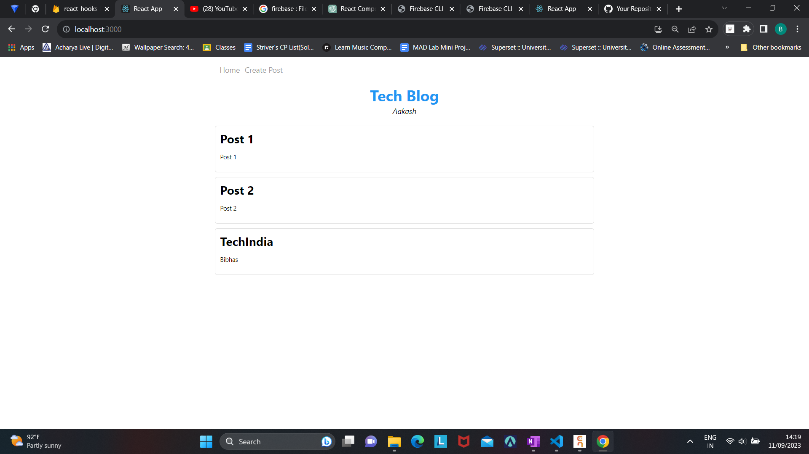
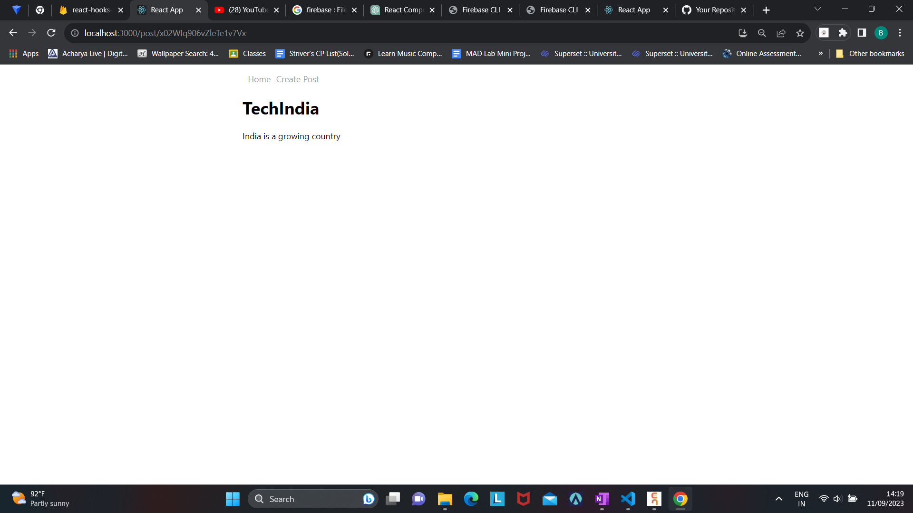

# React Blog App

This is a simple React application that demonstrates how to set up and use React Router for navigation. The app consists of multiple pages, including a home page, a post detail page, and a create post page. React Router is used to handle client-side routing and navigation between these pages.

## Table of Contents

- [Features](#features)
- [Installation](#installation)
- [Usage](#usage)
- [Folder Structure](#folder-structure)
- [Technologies Used](#technologies-used)
- [Contributing](#contributing)
- [License](#license)

## Features

- **Multiple Pages:** The app includes multiple pages, each with its own route.
- **Client-Side Routing:** React Router is used for client-side routing, enabling navigation between pages without full page reloads.
- **Dynamic Route Parameters:** The post detail page uses dynamic route parameters to display the details of a specific post.
- **Form Submission:** The create post page includes a form that allows users to submit new posts to the application.

## Installation

To run this project locally, follow these steps:

1. Clone the repository to your local machine:

   ```bash
   git clone https://github.com/your-username/your-react-router-app.git
   ```

2. Navigate to the project folder:

   ```bash
   cd your-react-router-app
   ```

3. Install project dependencies using npm or yarn:

   ```bash
   npm install
   # or
   yarn install
   ```

4. Start the development server:

   ```bash
   npm start
   # or
   yarn start
   ```

5. Open your browser and navigate to `http://localhost:3000` to view the app.

## Usage

- **Home Page:** The home page displays a list of posts.
- **Post Detail Page:** Clicking on a post on the home page will navigate to the post detail page, showing the title and content of the selected post.
- **Create Post Page:** Access the create post page to submit a new post by providing a title, subtitle, and content.

## Folder Structure

The project follows a folder structure that separates components and routes:

- `src/`: The main source code folder.
  - `components/`: Contains React components used in the app.
  - `pages/`: Each page of the app is defined as a separate component.
  - `App.js`: The main application component that sets up routes.
  - ...

## Technologies Used

- React
- React Router
- Firebase (Firestore)
- HTML
- CSS


## ScreenShots




## Contributing

Contributions are welcome! If you would like to contribute to the project, please follow our [Contribution Guidelines](CONTRIBUTING.md).

## License

This project is licensed under the [MIT License](LICENSE).

Feel free to customize this README to include more specific details about your application or any additional information you'd like to provide to users and contributors.